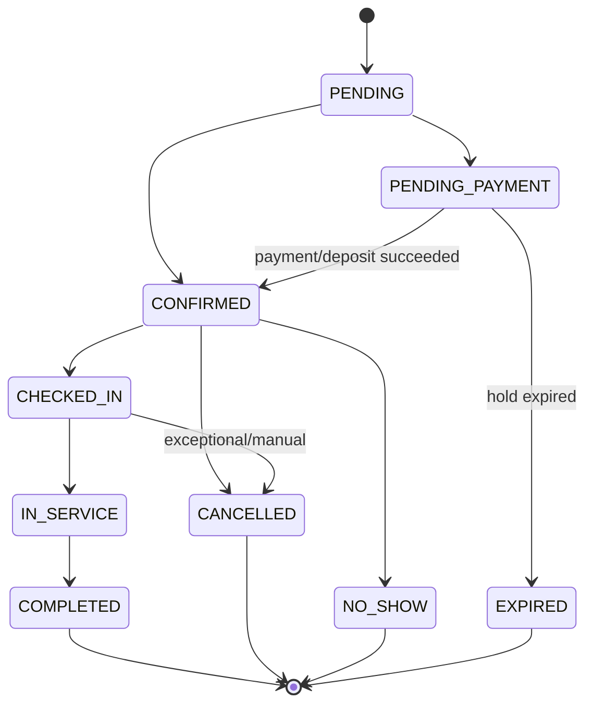
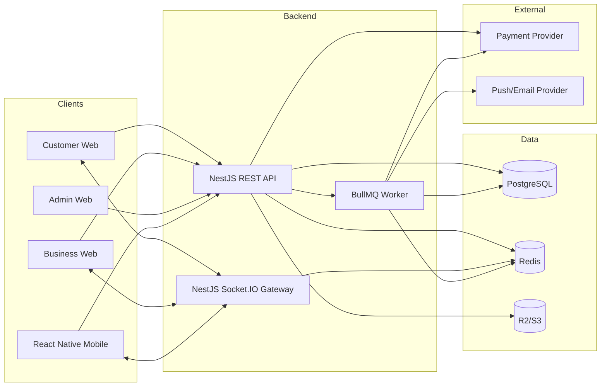

# BOOKFLOW — TÀI LIỆU TỔNG QUAN DỰ ÁN

**Tên sản phẩm:** BookFlow  
**Loại sản phẩm:** Multi-tenant SaaS Booking & Realtime Queue Platform  
**Định hướng:** Production-grade portfolio project cho Web Fullstack Developer, có React Native mobile client  
**Phiên bản tài liệu:** 1.0  
**Ngày cập nhật:** 17/09/2026  
**Trạng thái:** Source of Truth cho phân tích, thiết kế và triển khai

---

## 0. HƯỚNG DẪN DÀNH CHO AI / DEVELOPER

Tài liệu này là **nguồn yêu cầu và kiến trúc chính thức** của BookFlow. Khi AI/Codex/Developer triển khai dự án phải tuân thủ các nguyên tắc sau:

1. Đọc toàn bộ tài liệu trước khi thay đổi kiến trúc, database schema, domain model hoặc public API.
2. Không tự ý giản lược các business rule cốt lõi như tenant isolation, chống double booking, payment idempotency, signed QR, RBAC và booking state machine.
3. Không viết mock-only implementation nếu task yêu cầu chức năng hoàn chỉnh. UI phải kết nối API thật, API phải thao tác dữ liệu thật.
4. Không đưa business logic phức tạp vào controller hoặc React component. Logic booking, availability, queue, payment, permission phải có application/domain service riêng.
5. Mọi dữ liệu tenant-scoped phải được xác định `business_id` từ authenticated context; không tin `business_id` tùy ý do client gửi khi endpoint không cần thiết.
6. Mọi endpoint mutation quan trọng phải validate input, authorization, tenant scope, domain state và transaction boundary.
7. Mọi event realtime phải có authorization theo room/channel; không broadcast dữ liệu cross-tenant.
8. Mọi webhook payment phải verify signature và xử lý idempotent.
9. Mọi booking create/reschedule phải chịu concurrency control ở database; kiểm tra availability ở frontend không đủ để chống race condition.
10. Khi thay đổi requirement, cập nhật tài liệu này cùng code nếu thay đổi đó trở thành quyết định chính thức.

### 0.1 Definition of Done chung

Một feature chỉ được xem là hoàn thành khi:

- UI hoàn thiện và responsive ở surface liên quan.
- API/worker/realtime liên quan đã triển khai thật.
- Validation và error state đầy đủ.
- Authorization và tenant isolation đúng.
- Database migration/seed cập nhật nếu cần.
- Unit/integration/E2E test cho luồng quan trọng.
- Không còn TODO giả lập trong critical path.
- Logging và error code đủ để debug.
- README/API docs được cập nhật khi contract thay đổi.

---

# 1. EXECUTIVE SUMMARY

BookFlow là nền tảng SaaS dành cho doanh nghiệp dịch vụ có nhu cầu nhận lịch hẹn và quản lý lượt phục vụ. Một doanh nghiệp có thể tạo nhiều chi nhánh, dịch vụ, nhân viên, lịch làm việc, chính sách booking, voucher và cấu hình queue. Khách hàng có thể sử dụng web/mobile để tìm doanh nghiệp, chọn dịch vụ, nhân viên, khung giờ, thanh toán cọc, nhận QR check-in, theo dõi queue realtime và đánh giá sau khi hoàn thành.

BookFlow không khóa vào một ngành cụ thể. Các vertical mục tiêu gồm:

- Barber / Hair Salon.
- Spa / Nail.
- Clinic / Dental clinic ở mức booking dịch vụ, không xử lý hồ sơ y tế.
- Garage / Vehicle maintenance.
- Photography studio.
- Consulting / Coaching.
- Pet grooming / Pet care.

Dự án được thiết kế để thể hiện năng lực Web Fullstack ở mức production-oriented thông qua:

- Next.js web applications.
- React Native + Expo mobile application.
- NestJS backend API.
- PostgreSQL transactional data model.
- Redis cache/locking/pub-sub.
- Realtime WebSocket queue.
- Background jobs và notification scheduling.
- Multi-tenant SaaS isolation.
- RBAC/permission system.
- Booking/scheduling engine có concurrency protection.
- QR check-in có chữ ký.
- Payment provider abstraction và webhook idempotency.
- Analytics dashboard.
- Docker, CI/CD, observability và automated testing.

---

# 2. PRODUCT VISION VÀ MỤC TIÊU

## 2.1 Product vision

Cho phép một doanh nghiệp dịch vụ chuyển toàn bộ quy trình từ "khách nhắn tin hỏi lịch" sang một flow có cấu trúc:

```text
Discover -> Select service -> Find availability -> Book -> Pay deposit
-> Receive reminder -> QR check-in -> Realtime queue -> Service
-> Complete -> Review -> Analytics
```

## 2.2 Mục tiêu nghiệp vụ

- Giảm thao tác thủ công khi nhận và sắp xếp lịch.
- Hạn chế booking trùng lịch.
- Hạn chế no-show thông qua reminder và deposit.
- Quản lý walk-in và appointment trong cùng hệ thống.
- Cung cấp dữ liệu doanh thu, công suất và hành vi khách hàng.
- Cho phép doanh nghiệp có nhiều branch và staff với permission rõ ràng.

## 2.3 Mục tiêu kỹ thuật

- Có domain model đủ sâu nhưng vẫn triển khai được bởi một developer.
- Tách biệt client, API, worker và infrastructure theo hướng scale được.
- Có các vấn đề thực tế để chứng minh khả năng system design: race condition, idempotency, realtime consistency, multi-tenancy và scheduled jobs.
- Cho phép deploy portfolio với chi phí gần 0 USD/tháng bằng free tiers.

## 2.4 Không thuộc phạm vi chính

- Hồ sơ bệnh án, đơn thuốc hoặc dữ liệu y tế chuyên sâu.
- Payroll/accounting đầy đủ.
- ERP/inventory phức tạp.
- Marketplace logistics.
- Video call.
- Machine-learning recommendation bắt buộc.

Các phần trên có thể mở rộng sau nhưng không phải core requirement.

---

# 3. ACTOR VÀ ROLE

## 3.1 Customer

Khách hàng cuối sử dụng customer web/mobile.

Chức năng:

- Đăng ký/đăng nhập.
- Search/discover business.
- Xem branch, service, staff, review.
- Kiểm tra availability.
- Tạo/reschedule/cancel booking.
- Apply voucher.
- Thanh toán/cọc.
- Xem QR check-in.
- Theo dõi queue realtime.
- Nhận push/in-app/email notification.
- Review sau completion.
- Quản lý profile và booking history.

## 3.2 Staff

Nhân viên trực tiếp phục vụ khách.

- Xem lịch của bản thân.
- Xem customer/booking được phép.
- Start/complete service.
- Quản lý trạng thái queue theo permission.
- Cập nhật availability/blocked time nếu được cho phép.

## 3.3 Manager

- Quản lý lịch booking tại branch.
- Tạo/cập nhật staff/service tùy permission.
- Quản lý queue.
- Xem customer CRM.
- Xem analytics branch.
- Xử lý cancel/refund nếu được cấp quyền.

## 3.4 Business Owner

Tenant owner.

- Toàn quyền trong business.
- Quản lý branches, staff, roles, permissions.
- Subscription và billing của SaaS.
- Analytics toàn business.
- Payment provider settings.
- Business settings.

## 3.5 Platform Admin

Quản trị nền tảng BookFlow.

- Quản lý businesses/users/subscriptions.
- Suspend/restore account.
- Xem platform metrics.
- Feature flags.
- Audit/support tools.

## 3.6 RBAC model

Role không được hard-code hoàn toàn. Hệ thống có default roles nhưng support custom role.

Permission naming convention:

```text
<resource>.<action>
```

Ví dụ:

```text
booking.read
booking.create
booking.update
booking.cancel
booking.refund
queue.read
queue.manage
staff.read
staff.manage
service.manage
customer.read
analytics.read
role.manage
branch.manage
subscription.manage
```

---

# 4. SYSTEM SURFACES

BookFlow gồm 4 user-facing applications và backend platform.

## 4.1 Customer Web

**Tech:** Next.js + TypeScript.

Mục tiêu:

- SEO/discovery.
- Business/service detail.
- Booking từ browser.
- Booking detail và QR.
- Account/profile.

## 4.2 Customer Mobile

**Tech:** React Native + Expo + Expo Router.

Mục tiêu:

- Booking experience.
- Push notification.
- Camera/QR.
- Geolocation.
- Realtime queue.
- Secure token storage.

## 4.3 Business Web

**Tech:** Next.js.

Các module:

- Dashboard.
- Calendar.
- Bookings.
- Queue.
- Customers.
- Services.
- Staff.
- Branches.
- Promotions.
- Reviews.
- Payments.
- Analytics.
- Roles & Permissions.
- Settings.

## 4.4 Admin Web

**Tech:** Next.js.

- Platform overview.
- Businesses.
- Users.
- Subscriptions.
- System transactions.
- Reports.
- Feature flags.
- Audit logs.

## 4.5 Backend

**Tech:** NestJS + PostgreSQL + Prisma + Redis + BullMQ + Socket.IO.

Backend cung cấp REST API, WebSocket gateway, background job processing, scheduled jobs, integrations và domain logic.

---

# 5. KIẾN TRÚC TỔNG THỂ

```mermaid
flowchart TB
    CW[Customer Web - Next.js]
    BW[Business Web - Next.js]
    AW[Admin Web - Next.js]
    MA[Customer Mobile - React Native/Expo]

    API[NestJS API]
    WS[WebSocket Gateway]
    WORKER[Background Worker]

    PG[(PostgreSQL)]
    REDIS[(Redis)]
    OBJ[(R2/S3 Object Storage)]
    PAY[Payment Provider]
    PUSH[Push/Email Provider]

    CW --> API
    BW --> API
    AW --> API
    MA --> API

    BW <--> WS
    MA <--> WS
    CW <--> WS

    API --> PG
    API --> REDIS
    API --> OBJ
    API --> PAY
    API --> WORKER

    WORKER --> REDIS
    WORKER --> PG
    WORKER --> PUSH
    WORKER --> PAY

    WS --> REDIS
```



### 5.1 Architectural style

- Modular monolith ở backend giai đoạn portfolio/production-small.
- Module boundaries rõ để có thể tách service sau nếu cần.
- REST cho command/query thông thường.
- WebSocket cho realtime updates.
- BullMQ/jobs cho task không cần nằm trên request path.
- PostgreSQL là source of truth cho transactional state.
- Redis không được xem là source of truth cho booking/payment.

### 5.2 Lý do chọn modular monolith

Microservices không cần thiết cho quy mô portfolio và làm tăng deployment complexity. Modular monolith vẫn cho phép thể hiện architecture tốt nếu domain boundary rõ và không coupling tùy tiện.

---

# 6. MULTI-TENANCY

## 6.1 Tenant definition

Một `business` là một tenant.

Ví dụ:

```text
Business A: Gentleman Barber
Business B: Luna Spa
Business C: Happy Pet
```

## 6.2 Tenant-scoped entities

Các bảng sau phải gắn `business_id` trực tiếp hoặc có đường quan hệ không mơ hồ tới business:

- branches
- services
- service_categories
- staff_profiles
- staff_services
- working_hours
- staff_leaves
- customers (business CRM profile)
- bookings
- queue_tickets
- vouchers
- reviews
- payment configurations
- business roles
- audit logs

## 6.3 Tenant isolation rules

- API lấy current tenant từ membership/session context.
- `business_id` không được client tùy ý override.
- Repository/query helper bắt buộc nhận business scope.
- Unique constraints phải cân nhắc tenant scope, ví dụ `(business_id, slug)`.
- Cache key phải có tenant identifier.
- WebSocket room phải có tenant/branch identifier.
- Object storage path phải namespace theo business.

Ví dụ cache key:

```text
business:{businessId}:branch:{branchId}:availability:{staffId}:{date}
```

---

# 7. BUSINESS ONBOARDING

Flow:

```text
Register account
-> Create business
-> Business profile
-> Create first branch
-> Create service categories/services
-> Invite/create staff
-> Configure working hours
-> Configure booking rules
-> Configure queue rules
-> Publish business
```

## 7.1 Business fields

- id
- owner_user_id
- name
- slug
- legal/display information
- business_type
- timezone
- currency
- phone/email
- logo/banner
- status
- subscription_plan
- published_at
- created_at/updated_at

## 7.2 Publish validation

Business chỉ được publish khi tối thiểu có:

- 1 active branch.
- 1 active service.
- 1 staff có thể cung cấp service hoặc service cho phép "any staff".
- Working hours hợp lệ.

---

# 8. BRANCH MANAGEMENT

Một business có nhiều branch.

Branch fields:

- id
- business_id
- name
- slug
- address
- latitude/longitude
- timezone override optional
- phone
- email
- opening_hours
- queue_enabled
- booking_enabled
- status

Rules:

- Branch opening hours giới hạn slot khả dụng.
- Staff có thể thuộc nhiều branch thông qua mapping.
- Service có thể khả dụng tại một subset branch.
- Queue là branch-scoped.

---

# 9. SERVICE MANAGEMENT

Service fields:

- id
- business_id
- category_id
- name
- slug
- description
- duration_minutes
- buffer_before_minutes
- buffer_after_minutes
- price
- deposit_type: NONE | FIXED | PERCENT
- deposit_value
- online_booking_enabled
- walk_in_enabled
- active

Ví dụ:

```text
Haircut
Duration: 30 minutes
Buffer after: 10 minutes
Price: 120,000 VND
Deposit: 20%
```

Booking resource occupation:

```text
09:00-09:30 service
09:30-09:40 buffer
Next possible start: 09:40
```

---

# 10. STAFF MANAGEMENT

Staff profile:

- user_id optional, cho phép tạo staff trước khi staff nhận invite.
- business_id
- display_name
- title
- avatar
- bio
- active
- default_branch

Mappings:

- staff_branches
- staff_services
- staff_roles

Staff schedule:

- recurring working hours.
- breaks.
- one-off blocked time.
- leave.
- special date override.

Staff có thể có commission metadata nhưng payroll đầy đủ không phải core scope.

---

# 11. SCHEDULING VÀ AVAILABILITY ENGINE

Đây là module domain quan trọng nhất.

## 11.1 Input

```json
{
  "businessId": "bus_001",
  "branchId": "branch_001",
  "serviceId": "svc_001",
  "staffId": "staff_001",
  "date": "2026-09-20",
  "timezone": "Asia/Ho_Chi_Minh"
}
```

`staffId` có thể optional khi khách chọn "Any available staff".

## 11.2 Data ảnh hưởng availability

- Branch opening hours.
- Staff recurring working hours.
- Staff leave.
- Staff special override.
- Existing booking.
- Booking buffer.
- Blocked slots.
- Service duration.
- Service/staff compatibility.
- Service/branch compatibility.
- Booking minimum lead time.
- Booking maximum advance window.
- Slot interval, ví dụ 15 phút.

## 11.3 Algorithm khái quát

```text
1. Resolve timezone.
2. Build branch open intervals for target date.
3. Intersect with staff working intervals.
4. Subtract leave, breaks and blocked intervals.
5. Fetch occupied intervals from active bookings.
6. Expand occupied interval by service buffers where relevant.
7. Generate candidate start times using configured slot interval.
8. Keep candidate only when entire requested service interval fits.
9. Return slots sorted by time.
```

## 11.4 Booking states tính là occupied

Tối thiểu:

- PENDING_PAYMENT nếu đang giữ slot và hold chưa hết hạn.
- CONFIRMED.
- CHECKED_IN.
- IN_SERVICE.

Không occupied:

- CANCELLED.
- COMPLETED.
- NO_SHOW.
- EXPIRED.

## 11.5 Temporary slot hold

Khi payment/deposit cần thời gian:

```text
AVAILABLE -> HELD (5-10 minutes) -> CONFIRMED
                            \-> EXPIRED
```

Hold cần `expires_at`. Worker hoặc lazy cleanup sẽ bỏ expired holds.

## 11.6 Availability caching

Có thể cache short TTL theo:

```text
availability:{business}:{branch}:{staff}:{service}:{date}
```

Mọi mutation ảnh hưởng lịch phải invalidate key liên quan.

Cache chỉ tối ưu read; bước create booking vẫn phải kiểm tra lại trong transaction.

---

# 12. CHỐNG DOUBLE BOOKING VÀ CONCURRENCY

Frontend availability không đảm bảo slot còn trống khi request create tới backend.

## 12.1 Race condition cần xử lý

```text
Customer A: check 10:00 -> available
Customer B: check 10:00 -> available
A create booking
B create booking cùng thời điểm
```

Nếu backend chỉ `find then create` ở isolation thông thường có thể tạo trùng.

## 12.2 Required protection

Booking write path phải:

1. Bắt đầu DB transaction.
2. Acquire lock phù hợp theo staff/resource/date hoặc advisory lock.
3. Recalculate/check conflict trong transaction.
4. Create booking/hold.
5. Commit.
6. Publish post-commit event.

Có thể sử dụng PostgreSQL advisory lock hoặc SERIALIZABLE transaction tùy implementation. Nếu dùng Redis lock thì database constraint/transaction vẫn là lớp bảo vệ cuối cùng.

## 12.3 Conflict error

```json
{
  "success": false,
  "error": {
    "code": "BOOKING_SLOT_UNAVAILABLE",
    "message": "The selected time slot is no longer available."
  }
}
```

Client phải refresh availability và yêu cầu người dùng chọn slot khác.

---

# 13. BOOKING DOMAIN

## 13.1 Booking state machine



## 13.2 Booking fields

- id
- public_code
- business_id
- branch_id
- customer_user_id nullable cho walk-in guest
- business_customer_id
- staff_id
- service_id hoặc booking_services mapping
- start_at
- end_at
- timezone
- status
- source: WEB | MOBILE | BUSINESS_WEB | WALK_IN
- subtotal
- discount_amount
- tax_amount optional
- total_amount
- deposit_required
- deposit_paid
- note
- cancellation_reason
- checked_in_at
- service_started_at
- completed_at
- created_at/updated_at

## 13.3 Booking create flow

```text
Validate request
-> Resolve tenant/business
-> Resolve branch/service/staff
-> Check business rules
-> Calculate price/voucher
-> Transaction + lock
-> Re-check availability
-> Create booking/hold
-> Create payment intent if needed
-> Commit
-> Publish booking.created
-> Enqueue notifications/reminders
-> Return booking
```

## 13.4 Reschedule

Reschedule phải được xem như mutation có concurrency protection. Không update `start_at` trực tiếp mà không check availability.

## 13.5 Cancellation

Cancellation policy được cấu hình theo business:

- cancel_before_minutes.
- refund deposit yes/no/percentage.
- cancellation fee optional.

Cancelled booking không được tái active trực tiếp; tạo booking mới nếu cần.

---

# 14. WALK-IN VÀ REALTIME QUEUE

Booking và Queue là hai domain liên quan nhưng không đồng nhất.

## 14.1 Queue entry sources

- Appointment check-in.
- Walk-in customer.
- Manual business entry.

## 14.2 Queue ticket fields

- id
- business_id
- branch_id
- booking_id nullable
- customer_id nullable
- service_id
- preferred_staff_id nullable
- assigned_staff_id nullable
- ticket_number, ví dụ A023
- status
- position metadata/cache
- joined_at
- called_at
- service_started_at
- completed_at
- cancelled_at

## 14.3 Queue states

```text
WAITING
CALLED
SERVING
COMPLETED
SKIPPED
CANCELLED
```

## 14.4 Queue serving flow

```text
WAITING -> CALLED -> SERVING -> COMPLETED
              |          |
              -> SKIPPED -> optional requeue policy
```

## 14.5 Queue ordering

Default:

- priority flag nếu business hỗ trợ.
- scheduled appointment grace rules.
- joined_at.

Không hard-code FIFO duy nhất nếu business có appointment + walk-in mix.

## 14.6 Queue number

Ticket number có thể reset theo branch/ngày:

```text
A001, A002, ...
```

Public number không dùng làm database primary key.

---

# 15. REALTIME CONTRACT

## 15.1 Technology

Socket.IO trên NestJS gateway; Redis adapter/pub-sub khi scale nhiều API instances.

## 15.2 Rooms

```text
business:{businessId}
branch:{branchId}
customer:{customerId}
staff:{staffId}
```

Join room phải authorize server-side.

## 15.3 Events

Server -> Client:

```text
booking.created
booking.updated
booking.cancelled
queue.snapshot
queue.updated
queue.ticket.called
queue.ticket.serving
queue.ticket.completed
notification.created
staff.status.updated
```

## 15.4 Event envelope

```json
{
  "event": "queue.updated",
  "version": 1,
  "occurredAt": "2026-09-17T03:30:00.000Z",
  "data": {
    "branchId": "branch_001",
    "ticketId": "qt_001"
  }
}
```

Client không nên phụ thuộc vào implicit payload shape không versioned cho các event quan trọng.

## 15.5 Reconnect

Khi reconnect, client phải fetch snapshot mới; không giả định đã nhận đủ mọi event trong lúc mất kết nối.

---

# 16. ESTIMATED WAITING TIME

MVP-quality production logic có thể sử dụng deterministic estimate:

```text
sum(estimated duration của tickets trước customer)
/ số staff có thể phục vụ tương ứng
```

Nâng cấp bằng historical data:

- average actual service duration per service/staff.
- current staff throughput.
- current serving elapsed time.
- no-show/skip rate.

Kết quả luôn là estimate và UI phải thể hiện `~ 15 min`, không cam kết tuyệt đối.

---

# 17. QR CHECK-IN

## 17.1 QR payload

Không encode plain `bookingId` duy nhất.

QR phải chứa signed token hoặc opaque check-in token.

Ví dụ claims:

```json
{
  "type": "booking_checkin",
  "bookingId": "bk_123",
  "customerId": "cus_123",
  "exp": 1789600000,
  "nonce": "random-value"
}
```

Signed bằng HMAC/JWT secret riêng cho check-in.

## 17.2 Check-in validation

Backend phải:

- Verify signature.
- Verify expiry.
- Verify booking exists.
- Verify authenticated customer hoặc business scanner policy.
- Verify booking state.
- Verify configurable early/late check-in window.
- Prevent duplicate queue ticket.

## 17.3 Scanner surfaces

- Customer có thể hiển thị QR.
- Business web/mobile scanner hoặc reception camera scan QR.
- Customer self-check-in bằng location/QR là optional extension.

---

# 18. NOTIFICATION SYSTEM

## 18.1 Channels

- IN_APP.
- PUSH.
- EMAIL.
- SMS optional, không bắt buộc vì chi phí.

## 18.2 Notification types

```text
BOOKING_CONFIRMED
BOOKING_REMINDER_24H
BOOKING_REMINDER_1H
BOOKING_RESCHEDULED
BOOKING_CANCELLED
PAYMENT_SUCCESS
PAYMENT_FAILED
QUEUE_JOINED
QUEUE_POSITION_CHANGED
QUEUE_NEAR_TURN
QUEUE_CALLED
REVIEW_REQUEST
BUSINESS_INVITE
```

## 18.3 Architecture

Request path không gửi email/push trực tiếp.

```text
API mutation
-> DB commit
-> domain event
-> BullMQ notification job
-> channel provider
-> notification delivery record
```

## 18.4 Device tokens

Mobile device token table lưu:

- user_id
- platform
- push_token
- device_id
- enabled
- last_seen_at

Token invalid phải được disable sau provider error phù hợp.

---

# 19. BACKGROUND JOBS

BullMQ queues gợi ý:

```text
notifications
booking-reminders
payments
analytics
cleanup
email
```

Jobs cần `jobId` hoặc idempotency key cho task có thể retry.

Các job chính:

- Send booking confirmation.
- Schedule reminder 24h/1h.
- Expire booking hold.
- Request review after completion.
- Retry notification.
- Reconcile payment webhook.
- Aggregate daily analytics.
- Cleanup expired tokens.

Worker retry phải phân loại lỗi retryable và permanent.

---

# 20. PAYMENT VÀ DEPOSIT

## 20.1 Provider abstraction

```typescript
interface PaymentProvider {
  createPayment(input: CreatePaymentInput): Promise<CreatePaymentResult>;
  verifyWebhook(input: RawWebhookInput): Promise<VerifiedPaymentEvent>;
  refund(input: RefundInput): Promise<RefundResult>;
}
```

Provider mục tiêu:

- Stripe cho demo/international.
- VNPay hoặc MoMo có thể thêm adapter.

## 20.2 Payment states

```text
PENDING
PROCESSING
PAID
FAILED
CANCELLED
PARTIALLY_REFUNDED
REFUNDED
```

## 20.3 Webhook rules

- Verify signature trên raw body.
- Lưu provider event ID.
- Unique constraint trên provider event ID.
- Xử lý webhook idempotent.
- Không trust success redirect từ frontend.
- Không mark PAID chỉ vì client báo thanh toán thành công.

## 20.4 Deposit

Service hỗ trợ:

```text
NONE
FIXED_AMOUNT
PERCENTAGE
```

Tính deposit phải dùng server-side monetary logic; không lấy số tiền do client gửi làm source of truth.

---

# 21. VOUCHER / PROMOTION

Voucher fields:

- code
- type: PERCENT | FIXED
- value
- max_discount
- minimum_order
- start_at/end_at
- total_usage_limit
- per_customer_limit
- applicable_service/branch restrictions
- status

Validation order:

1. Exists/active.
2. Time window.
3. Business/branch/service applicability.
4. Minimum amount.
5. Global usage limit.
6. Per-customer limit.
7. Calculate discount with cap.

Voucher usage phải tạo trong transaction phù hợp với booking/payment lifecycle để tránh vượt usage do concurrency.

---

# 22. CUSTOMER CRM

BookFlow có hai khái niệm:

- Global `user` account.
- `business_customer` profile thuộc một business.

Business customer profile có:

- user_id nullable cho guest/walk-in.
- business_id.
- name/contact.
- total_bookings derived/aggregated.
- total_spent aggregated.
- no_show_count.
- last_visit_at.
- tags/notes có permission.

Business A không được xem CRM data của Business B.

---

# 23. REVIEW SYSTEM

Review chỉ được tạo cho booking `COMPLETED`, một review mỗi booking.

Fields:

- booking_id
- business_id
- branch_id
- customer_id
- overall_rating 1..5
- staff_rating optional
- service_rating optional
- waiting_time_rating optional
- comment
- media optional
- status/moderation

Business có thể reply review nhưng không sửa nội dung customer.

---

# 24. ANALYTICS

## 24.1 Core KPIs

- Revenue.
- Number of bookings.
- Completion rate.
- Cancellation rate.
- No-show rate.
- Average order value.
- New vs returning customers.
- Top services.
- Top staff by booking/revenue/rating.
- Peak hours.
- Branch performance.
- Average waiting time.

## 24.2 Data strategy

Ở quy mô nhỏ, query PostgreSQL với indexed aggregate là đủ.

Có thể tạo daily aggregate tables/materialized views:

```text
business_daily_metrics
branch_daily_metrics
staff_daily_metrics
service_daily_metrics
```

Không bắt buộc ClickHouse/data warehouse cho portfolio.

## 24.3 Dashboard filters

- Date range.
- Branch.
- Staff.
- Service.

---

# 25. SEARCH VÀ LOCATION

## 25.1 Search

Customer search theo:

- business name.
- service name.
- category.
- location text.

Khởi đầu với PostgreSQL full-text/trigram. Có thể nâng cấp Meilisearch/Elasticsearch nếu cần.

## 25.2 Location

Branch lưu latitude/longitude. PostGIS được khuyến nghị nếu triển khai nearby search tốt.

Filters:

- within distance.
- rating.
- price range.
- category.
- available today.
- open now.

`open now` phải tính theo branch timezone/opening hours, không chỉ browser local time.

---

# 26. FILE VÀ MEDIA STORAGE

Object storage: Cloudflare R2 hoặc S3-compatible.

Objects:

- business logo/banner.
- branch gallery.
- service image.
- staff avatar.
- review media.

Upload flow:

```text
Client -> API request presigned upload URL
API -> validate mime/size/scope -> signed URL
Client -> upload directly to R2
Client/API -> confirm object metadata
```

Rules:

- Không lưu binary vào PostgreSQL.
- Validate content type và max file size.
- Randomized object key.
- Namespace business assets.
- Private assets dùng signed read URL.

---

# 27. AUTHENTICATION VÀ SESSION

## 27.1 Supported auth

- Email/password.
- Google OAuth optional/recommended.

## 27.2 Token strategy

API hỗ trợ:

- Short-lived access token.
- Refresh token rotation.
- Refresh token persistence/revocation metadata.

Business web có thể dùng secure HttpOnly cookie strategy; mobile dùng SecureStore.

Không lưu long-lived token trong localStorage nếu có thể tránh.

## 27.3 Security events

- login success/failure.
- password reset.
- refresh token reuse/revocation.
- membership role changes.

---

# 28. DATABASE MODEL

Tên bảng có thể điều chỉnh theo convention, nhưng domain relationship phải giữ.

## 28.1 Identity

### users

- id UUID
- email unique
- password_hash nullable với OAuth-only
- full_name
- phone
- avatar_url
- status
- email_verified_at
- created_at
- updated_at

### auth_identities

- id
- user_id
- provider
- provider_user_id
- metadata
- unique(provider, provider_user_id)

### refresh_tokens

- id
- user_id
- token_hash
- family_id
- expires_at
- revoked_at
- created_at

## 28.2 Tenant và membership

### businesses

- id
- owner_user_id
- name
- slug unique
- type
- timezone
- currency
- status
- subscription_plan_id nullable
- published_at
- created_at
- updated_at

### business_members

- id
- business_id
- user_id
- status
- joined_at
- unique(business_id, user_id)

### roles

- id
- business_id nullable cho system role template
- name
- is_system

### permissions

- id
- code unique
- description

### role_permissions

- role_id
- permission_id
- primary key(role_id, permission_id)

### member_roles

- business_member_id
- role_id

## 28.3 Branch/service/staff

### branches

- id
- business_id
- name
- slug
- address
- latitude
- longitude
- phone
- timezone nullable
- status
- unique(business_id, slug)

### branch_opening_hours

- id
- branch_id
- day_of_week
- start_time
- end_time
- closed

### service_categories

- id
- business_id
- name
- sort_order
- active

### services

- id
- business_id
- category_id
- name
- slug
- duration_minutes
- buffer_before_minutes
- buffer_after_minutes
- price_minor
- currency
- deposit_type
- deposit_value
- active

Money nên lưu integer minor units nếu currency phù hợp hoặc Decimal type có quy ước rõ; không dùng JavaScript floating point cho calculation tài chính.

### service_branches

- service_id
- branch_id

### staff_profiles

- id
- business_id
- user_id nullable
- display_name
- title
- bio
- active

### staff_branches

- staff_id
- branch_id

### staff_services

- staff_id
- service_id
- custom_duration_minutes nullable
- custom_price_minor nullable

### staff_working_hours

- id
- staff_id
- branch_id nullable
- day_of_week
- start_time
- end_time

### staff_breaks

- id
- staff_id
- day_of_week/date override
- start_time
- end_time

### staff_leaves

- id
- staff_id
- start_at
- end_at
- reason
- status

### schedule_blocks

- id
- business_id
- staff_id
- branch_id
- start_at
- end_at
- reason

## 28.4 Customer và booking

### business_customers

- id
- business_id
- user_id nullable
- name
- email
- phone
- notes
- last_visit_at
- created_at
- unique business/user tùy nullable strategy

### bookings

- id
- public_code unique
- business_id
- branch_id
- customer_id
- staff_id
- status
- source
- start_at
- end_at
- hold_expires_at nullable
- subtotal_minor
- discount_minor
- total_minor
- deposit_required_minor
- deposit_paid_minor
- currency
- note
- cancellation_reason
- checked_in_at
- service_started_at
- completed_at
- created_at
- updated_at

Indexes tối thiểu:

```text
(business_id, branch_id, start_at)
(staff_id, start_at, end_at)
(customer_id, created_at desc)
(status, hold_expires_at)
```

### booking_services

Support future multi-service booking.

- id
- booking_id
- service_id
- service_name_snapshot
- duration_minutes_snapshot
- price_minor_snapshot
- sort_order

Snapshot đảm bảo booking lịch sử không bị thay đổi khi service đổi tên/giá.

## 28.5 Queue

### queue_tickets

- id
- business_id
- branch_id
- booking_id nullable
- customer_id nullable
- service_id
- preferred_staff_id nullable
- assigned_staff_id nullable
- ticket_number
- status
- priority
- joined_at
- called_at
- service_started_at
- completed_at
- cancelled_at

### queue_sequences

- branch_id
- business_date
- prefix
- last_number
- unique(branch_id, business_date, prefix)

## 28.6 Payment/promotion

### payments

- id
- business_id
- booking_id
- provider
- provider_payment_id
- type: DEPOSIT | FULL_PAYMENT | REFUND
- amount_minor
- currency
- status
- paid_at
- created_at

### payment_events

- id
- provider
- provider_event_id unique
- event_type
- payload_hash/reference
- processed_at
- status

### refunds

- id
- payment_id
- amount_minor
- provider_refund_id
- status
- reason

### vouchers

- id
- business_id
- code
- type
- value
- max_discount_minor
- minimum_order_minor
- starts_at
- ends_at
- total_usage_limit
- per_customer_limit
- active
- unique(business_id, code)

### voucher_usages

- id
- voucher_id
- booking_id
- customer_id
- discount_minor
- created_at

## 28.7 Review/notification/files

### reviews

- id
- booking_id unique
- business_id
- branch_id
- customer_id
- overall_rating
- staff_rating nullable
- service_rating nullable
- waiting_rating nullable
- comment
- status
- created_at

### review_media

- id
- review_id
- object_key
- sort_order

### notifications

- id
- user_id
- business_id nullable
- type
- title
- body
- data_json
- read_at
- created_at

### notification_deliveries

- id
- notification_id
- channel
- provider
- status
- attempt_count
- delivered_at
- failure_reason

### user_devices

- id
- user_id
- platform
- device_id
- push_token
- enabled
- last_seen_at

### media_objects

- id
- owner_type
- owner_id
- business_id nullable
- object_key
- mime_type
- size_bytes
- created_at

## 28.8 Subscription/audit

### subscription_plans

- id
- code
- name
- price_minor
- billing_interval
- active

### plan_features

- plan_id
- feature_code
- limit_value nullable
- enabled

### business_subscriptions

- id
- business_id
- plan_id
- status
- current_period_start
- current_period_end
- provider_subscription_id nullable

### audit_logs

- id
- business_id nullable
- actor_user_id
- action
- resource_type
- resource_id
- before_json nullable
- after_json nullable
- ip_address
- user_agent
- created_at

---

# 29. REST API DESIGN

Base path:

```text
/api/v1
```

Response success:

```json
{
  "success": true,
  "data": {},
  "meta": {}
}
```

Error:

```json
{
  "success": false,
  "error": {
    "code": "BOOKING_SLOT_UNAVAILABLE",
    "message": "The selected time slot is no longer available.",
    "details": {}
  }
}
```

## 29.1 Authentication

```text
POST /auth/register
POST /auth/login
POST /auth/refresh
POST /auth/logout
POST /auth/forgot-password
POST /auth/reset-password
GET  /auth/me
```

## 29.2 Customer discovery

```text
GET /businesses
GET /businesses/:slug
GET /businesses/:id/branches
GET /businesses/:id/services
GET /businesses/:id/staff
GET /businesses/:id/reviews
GET /branches/:id/availability
```

Availability query:

```text
GET /availability?branchId=&serviceId=&staffId=&date=
```

## 29.3 Customer booking

```text
POST /bookings
GET  /bookings
GET  /bookings/:id
POST /bookings/:id/reschedule
POST /bookings/:id/cancel
POST /bookings/:id/check-in
GET  /bookings/:id/check-in-qr
```

## 29.4 Queue

```text
GET  /branches/:branchId/queue
POST /branches/:branchId/queue/walk-in
POST /queue-tickets/:id/call
POST /queue-tickets/:id/start
POST /queue-tickets/:id/complete
POST /queue-tickets/:id/skip
POST /queue-tickets/:id/cancel
```

## 29.5 Business management

```text
POST /businesses
GET  /business/:businessId/dashboard
PATCH /business/:businessId

GET/POST/PATCH /business/:businessId/branches
GET/POST/PATCH /business/:businessId/services
GET/POST/PATCH /business/:businessId/staff
GET/POST/PATCH /business/:businessId/roles
GET /business/:businessId/customers
GET /business/:businessId/bookings
GET /business/:businessId/payments
GET /business/:businessId/analytics
```

Route naming có thể tinh chỉnh nhưng phải nhất quán và không leak resource cross-tenant.

## 29.6 Payment

```text
POST /bookings/:id/payment-intent
POST /payments/:id/refund
POST /webhooks/payments/:provider
```

Webhook endpoint không sử dụng auth user token; sử dụng provider signature verification.

## 29.7 Notifications

```text
GET  /notifications
POST /notifications/:id/read
POST /notifications/read-all
POST /devices
DELETE /devices/:id
```

---

# 30. API VALIDATION, PAGINATION VÀ IDEMPOTENCY

## 30.1 Validation

- DTO + class-validator/Zod equivalent ở boundary.
- Normalize email/phone/code.
- Không silent-coerce dữ liệu nguy hiểm.

## 30.2 Pagination

Danh sách lớn sử dụng cursor pagination nếu phù hợp; admin table có thể dùng page/limit nếu query ổn.

Response meta ví dụ:

```json
{
  "meta": {
    "nextCursor": "...",
    "hasNext": true
  }
}
```

## 30.3 Idempotency

Các command như payment/create order/critical mutation có thể hỗ trợ header:

```text
Idempotency-Key: <uuid>
```

Server lưu key + request hash + result cho khoảng thời gian xác định.

---

# 31. BUSINESS WEB UX

Sidebar chính:

```text
Dashboard
Calendar
Bookings
Queue
Customers
Services
Staff
Branches
Promotions
Reviews
Payments
Analytics
Team & Roles
Settings
```

## 31.1 Dashboard

Widgets:

- Today revenue.
- Today bookings.
- Waiting/serving queue.
- Completion/cancellation.
- Upcoming bookings.
- Revenue trend.
- Peak hour.

## 31.2 Calendar

Views:

- Day.
- Week.
- Month.
- Staff/resource view.

Features:

- Filters by branch/staff/service.
- Click booking detail.
- Create manual booking.
- Drag/drop reschedule chỉ khi backend validation thành công.
- Optimistic UI phải rollback khi conflict.

## 31.3 Queue screen

- Current serving.
- Waiting tickets.
- ETA.
- Call/start/complete/skip actions.
- Realtime update.

---

# 32. CUSTOMER MOBILE UX

Bottom tabs:

```text
Home | Explore | Bookings | Notifications | Profile
```

## 32.1 Home

- Search.
- Nearby businesses.
- Recent/recommended.
- Upcoming appointment.

## 32.2 Business detail

- Header/gallery.
- Rating/reviews.
- Services.
- Staff.
- Branch selection.
- Opening hours.
- Map/location.

## 32.3 Booking flow

```text
Service -> Branch -> Staff/Any Staff -> Date -> Time
-> Voucher -> Payment/Deposit -> Confirmation
```

## 32.4 Active queue

Hiển thị:

- Ticket number.
- Current serving number.
- People ahead.
- ETA.
- Realtime state.

## 32.5 Native capabilities

- Expo Notifications.
- Expo Camera/Barcode Scanner.
- SecureStore.
- Location permission.
- Deep linking từ notification.

---

# 33. STATE MANAGEMENT VÀ FRONTEND DATA

Recommended:

- TanStack Query: server state/cache.
- Zustand: lightweight client UI/session state khi cần.
- React Hook Form + Zod: forms.

Không duplicate server entities vào global Zustand nếu TanStack Query đã quản lý.

Realtime event handling:

```text
WebSocket event
-> validate event
-> update/invalidate TanStack Query cache
-> UI re-render
```

Sau reconnect: invalidate/fetch snapshot.

---

# 34. BACKEND MODULE STRUCTURE

```text
apps/api/src/
├── auth/
├── users/
├── businesses/
├── memberships/
├── roles/
├── branches/
├── services/
├── staff/
├── schedules/
├── availability/
├── bookings/
├── queues/
├── customers/
├── payments/
├── vouchers/
├── reviews/
├── notifications/
├── subscriptions/
├── analytics/
├── files/
├── audit/
├── realtime/
├── jobs/
└── common/
```

Layering guideline:

```text
Controller/Gateway
-> Application Service/Use Case
-> Domain logic
-> Repository/External adapter
```

Không bắt buộc pure DDD ceremony; ưu tiên rõ ràng, testable và KISS.

---

# 35. REPOSITORY / MONOREPO STRUCTURE

Recommended Turborepo:

```text
bookflow/
├── apps/
│   ├── customer-web/
│   ├── business-web/
│   ├── admin-web/
│   ├── mobile/
│   ├── api/
│   └── worker/              # có thể chạy chung API ở free hosting
│
├── packages/
│   ├── ui/
│   ├── api-client/
│   ├── types/
│   ├── validation/
│   ├── eslint-config/
│   ├── tsconfig/
│   └── domain-contracts/
│
├── infrastructure/
│   ├── docker/
│   └── scripts/
│
├── docs/
├── docker-compose.yml
├── turbo.json
└── package.json
```

Không import code server-only vào client packages.

---

# 36. TECH STACK CHÍNH THỨC

## Web

- Next.js.
- TypeScript.
- Tailwind CSS.
- shadcn/ui hoặc component layer riêng.
- TanStack Query.
- Zustand.
- React Hook Form.
- Zod.
- Recharts/ECharts.

## Mobile

- React Native.
- Expo.
- Expo Router.
- NativeWind hoặc style system nhất quán.
- TanStack Query.
- Zustand.
- Expo Notifications.
- Expo Camera.
- Expo SecureStore.

## Backend

- NestJS.
- Prisma ORM.
- PostgreSQL.
- Redis.
- BullMQ.
- Socket.IO.
- Swagger/OpenAPI.

## Infrastructure

- Docker / Docker Compose.
- GitHub Actions.
- Vercel cho web.
- Render free web service cho API demo.
- Supabase PostgreSQL free tier cho portfolio.
- Upstash Redis free tier.
- Cloudflare R2.
- Expo EAS.

---

# 37. REDIS USAGE

Redis được dùng có mục đích cụ thể:

- Cache.
- Rate limit counters.
- BullMQ.
- WebSocket pub/sub/adapter.
- Short-lived distributed coordination/lock nếu cần.

Không lưu permanent booking/payment state chỉ trong Redis.

Potential keys:

```text
bookflow:cache:business:{id}
bookflow:availability:{business}:{staff}:{date}
bookflow:rate:{key}
bookflow:ws:...
```

TTL phải xác định rõ.

---

# 38. SECURITY REQUIREMENTS

## 38.1 Application security

- Password hash Argon2/bcrypt với configuration phù hợp.
- Rate limit login/reset endpoints.
- DTO validation.
- Parameterized ORM queries.
- Security headers.
- CORS allowlist.
- Secure cookie nếu sử dụng cookie auth.
- CSRF protection nếu auth model cần.
- XSS-safe rendering và upload validation.

## 38.2 Authorization

Thứ tự kiểm tra mutation business:

```text
Authentication
-> business membership
-> permission
-> tenant scope
-> resource state
-> mutation
```

## 38.3 Data privacy

- Business staff chỉ xem customer data cần thiết.
- Audit các hành động nhạy cảm.
- Không log password/token/full payment credentials.
- Secrets chỉ ở environment/secret store.

## 38.4 Webhook security

- Raw body khi provider yêu cầu.
- Verify signature.
- Replay/idempotency protection.

---

# 39. ERROR CODE CATALOG

Một số domain error code chuẩn:

```text
AUTH_INVALID_CREDENTIALS
AUTH_TOKEN_EXPIRED
FORBIDDEN
TENANT_ACCESS_DENIED
BUSINESS_NOT_FOUND
BRANCH_CLOSED
SERVICE_NOT_AVAILABLE
STAFF_NOT_AVAILABLE
BOOKING_SLOT_UNAVAILABLE
BOOKING_INVALID_STATE
BOOKING_CANCELLATION_WINDOW_PASSED
BOOKING_ALREADY_CHECKED_IN
QUEUE_TICKET_ALREADY_EXISTS
QUEUE_INVALID_STATE
VOUCHER_INVALID
VOUCHER_EXPIRED
VOUCHER_USAGE_LIMIT_REACHED
PAYMENT_REQUIRED
PAYMENT_FAILED
PAYMENT_ALREADY_PROCESSED
REFUND_NOT_ALLOWED
QR_INVALID
QR_EXPIRED
RATE_LIMITED
```

Client map code sang UI message thay vì parse string message.

---

# 40. NON-FUNCTIONAL REQUIREMENTS

## 40.1 Performance

Portfolio target:

- Public cached GET p95 mục tiêu < 500 ms khi service đã warm.
- Mutation thông thường p95 < 800 ms không tính external payment latency.
- Availability query có index/caching hợp lý.
- Không N+1 query ở list screen lớn.

Free hosting cold start là ngoại lệ của demo environment.

## 40.2 Reliability

- Transaction cho critical write.
- Idempotent jobs/webhooks.
- Retry external integration có backoff.
- Database migration versioned.

## 40.3 Scalability

Scale path:

```text
1 API instance
-> multiple stateless API instances
-> Redis Socket.IO adapter
-> separate worker
-> read/analytics optimization
```

## 40.4 Accessibility

Web:

- Semantic HTML.
- Keyboard navigation.
- Form labels/errors.
- Reasonable contrast.
- Focus state.

Mobile:

- Accessibility labels cho interactive elements chính.

## 40.5 Internationalization

Architecture nên cho phép VI/EN nhưng không bắt buộc hoàn thiện mọi locale ở lần đầu.

Money/timezone không được hard-code VND/Asia Ho Chi Minh toàn hệ thống; business setting quyết định.

---

# 41. OBSERVABILITY

## 41.1 Logging

Structured JSON logs:

```json
{
  "level": "info",
  "event": "booking.created",
  "requestId": "req_123",
  "businessId": "bus_1",
  "bookingId": "bk_1",
  "durationMs": 45
}
```

## 41.2 Correlation

Mỗi request có `requestId/correlationId` truyền vào log và background event nếu phù hợp.

## 41.3 Monitoring

- Sentry: exceptions/frontend errors.
- Health endpoint.
- Metrics optional: Prometheus/Grafana ở local/paid deployment.

Health:

```text
GET /health/live
GET /health/ready
```

Readiness kiểm tra critical dependencies có mức độ hợp lý.

---

# 42. TESTING STRATEGY

## 42.1 Unit tests

Ưu tiên:

- availability interval logic.
- pricing/deposit.
- voucher calculation.
- booking state transition.
- queue ordering.
- permission rules.

## 42.2 Integration tests

- Booking transaction/concurrency.
- Tenant isolation.
- Database constraints.
- Payment webhook idempotency.
- Notification job enqueue.

## 42.3 E2E tests

Playwright web flows:

1. Business onboarding.
2. Configure branch/service/staff.
3. Customer search + book.
4. Business sees booking.
5. Check-in + queue progression.
6. Completion + review.

Mobile smoke tests có thể dùng React Native Testing Library; full device E2E là optional nếu thời gian hạn chế.

## 42.4 Concurrency test bắt buộc

Gửi nhiều create booking requests vào cùng slot và assert chỉ một booking hợp lệ được commit.

---

# 43. CI/CD

GitHub Actions pull request pipeline:

```text
Install
-> lint
-> typecheck
-> unit test
-> integration test
-> build affected apps
```

Main branch:

```text
CI passed
-> database migration strategy
-> deploy web
-> deploy API
-> smoke health check
```

Không tự chạy destructive migration trên production mà không review.

---

# 44. LOCAL DEVELOPMENT

Docker Compose services:

```text
postgres
redis
minio (S3-compatible local development)
mailpit optional
```

Apps có thể chạy Node local để hot reload.

Quick start mong muốn:

```bash
pnpm install
docker compose up -d
pnpm db:migrate
pnpm db:seed
pnpm dev
```

Seed phải tạo demo credentials/data rõ trong development, không seed password mẫu vào production.

---

# 45. DEPLOYMENT — PORTFOLIO 0 USD

## 45.1 Recommended mapping

| Component | Platform | Portfolio cost target |
|---|---|---:|
| Customer Web | Vercel Hobby | $0 |
| Business Web | Vercel Hobby | $0 |
| Admin Web | Vercel Hobby | $0 |
| NestJS API | Render Free Web Service | $0 |
| PostgreSQL | Supabase Free | $0 |
| Redis | Upstash Free | $0 |
| Object Storage | Cloudflare R2 free allowance | $0 |
| Mobile Builds | Expo EAS Free | $0 |
| Git/CI | GitHub | $0 |

Free-tier limits thay đổi theo nhà cung cấp; kiểm tra lại trước thời điểm deploy.

## 45.2 Free-demo caveats

- Render có thể cold start/sleep khi inactive.
- Background worker tách riêng có thể không free; demo có thể chạy processor cùng API process.
- Scheduled job không bảo đảm SLA nếu compute sleep.
- Supabase free project có chính sách inactivity/limits.
- Không coi free deployment là production SLA.

## 45.3 Upgrade path

Không đổi domain code khi nâng cấp:

```text
Render -> always-on container/AWS/Fly/paid platform
Supabase Free -> Supabase Pro/RDS
Upstash Free -> paid Redis/ElastiCache
Worker -> separate deployment
```

---

# 46. ENVIRONMENT VARIABLES

Không commit secret. Có `.env.example`.

Ví dụ:

```text
NODE_ENV=
PORT=
APP_URL=
CUSTOMER_WEB_URL=
BUSINESS_WEB_URL=
ADMIN_WEB_URL=

DATABASE_URL=
DIRECT_DATABASE_URL=
REDIS_URL=

JWT_ACCESS_SECRET=
JWT_REFRESH_SECRET=
JWT_ACCESS_TTL=
JWT_REFRESH_TTL=
QR_SIGNING_SECRET=

R2_ENDPOINT=
R2_ACCESS_KEY_ID=
R2_SECRET_ACCESS_KEY=
R2_BUCKET=
R2_PUBLIC_BASE_URL=

STRIPE_SECRET_KEY=
STRIPE_WEBHOOK_SECRET=

EXPO_ACCESS_TOKEN=
EMAIL_PROVIDER_API_KEY=
SENTRY_DSN=
```

Production validation phải fail fast khi missing required secret.

---

# 47. DOMAIN EVENTS

Internal events gợi ý:

```text
business.created
business.published
member.invited
booking.created
booking.confirmed
booking.rescheduled
booking.cancelled
booking.checked_in
booking.started
booking.completed
booking.no_show
queue.ticket.joined
queue.ticket.called
queue.ticket.started
queue.ticket.completed
payment.succeeded
payment.failed
refund.succeeded
review.created
```

Event handler không được làm mất transaction correctness. Critical state update nằm trong transaction; side effects có thể post-commit hoặc outbox pattern nếu nâng cấp reliability.

---

# 48. AUDIT LOGGING

Audit các mutation nhạy cảm:

- Role/permission change.
- Staff creation/deactivation.
- Service price change.
- Booking cancel by business.
- Refund.
- Subscription change.
- Business suspend.

Audit log không thay thế application log.

Ví dụ display:

```text
17 Sep 2026 10:22
Manager John changed Haircut price: 120,000 -> 150,000 VND
```

---

# 49. SUBSCRIPTION VÀ FEATURE GATING

Plans mẫu:

| Feature | Free | Pro | Business |
|---|---:|---:|---:|
| Branches | 1 | 3 | Unlimited |
| Staff | 3 | 15 | Unlimited |
| Monthly bookings | 100 | 3000 | Unlimited |
| Analytics | Basic | Advanced | Advanced |
| Custom roles | No | Yes | Yes |
| API access | No | No | Yes |

Feature guard concept:

```typescript
@RequireFeature('advanced_analytics')
```

Limit enforcement phải server-side, UI hide/disable chỉ là UX.

SaaS subscription payment có thể để sandbox nếu project tập trung booking payment trước.

---

# 50. DEMO DATA VÀ PORTFOLIO SCENARIO

Seed nên tạo một business hoàn chỉnh:

```text
Gentleman Barber
Ho Chi Minh City
Branches: District 1, Thu Duc
Services: Haircut, Hair + Wash, Hair + Beard
Staff: Minh, Nam, An
```

Customer demo:

```text
customer@bookflow.demo
```

Business demo:

```text
owner@bookflow.demo
manager@bookflow.demo
```

Credentials chỉ document ở demo environment, không dùng production secrets.

## 50.1 Demo script cho recruiter

1. Mở Customer Web/Mobile.
2. Search Gentleman Barber.
3. Chọn Haircut + staff Minh.
4. Chọn slot.
5. Checkout bằng sandbox payment.
6. Mở Business Web thấy booking xuất hiện.
7. Customer mở QR; business scan/check-in.
8. Queue update realtime trên cả hai client.
9. Business start/complete service.
10. Customer nhận review request.
11. Dashboard revenue/booking cập nhật.

Flow này thể hiện end-to-end fullstack rõ hơn một demo CRUD.

---

# 51. ACCEPTANCE CRITERIA THEO MODULE

## 51.1 Authentication

- User đăng ký/login/logout/refresh hoạt động.
- Refresh rotation/revocation có test.
- Unauthorized routes bị chặn.

## 51.2 Multi-tenant

- User Business A không đọc/sửa resource Business B.
- Integration test cho cross-tenant ID tampering.

## 51.3 Availability

- Tôn trọng branch hours/staff hours/break/leave/booking/buffer.
- Timezone đúng.
- Any-staff trả slot hợp lệ và staff assignment strategy rõ.

## 51.4 Booking

- Create/reschedule concurrency-safe.
- State transition validate.
- Cancellation policy đúng.
- Hold expire đúng.

## 51.5 Queue

- Appointment/walk-in tạo ticket đúng.
- Không duplicate ticket cho cùng booking active.
- Realtime update tới đúng branch/customer.

## 51.6 QR

- Forged/expired QR bị reject.
- Check-in idempotent.

## 51.7 Payment

- Sandbox payment end-to-end.
- Webhook signature verified.
- Duplicate webhook không duplicate state transition.

## 51.8 Notification

- Confirmation/reminder/queue-near-turn có job.
- Delivery failure được ghi lại/retry theo policy.

## 51.9 Business Web

- Dashboard/calendar/queue/service/staff/customer screens có API thật.
- Loading/error/empty state đầy đủ.

## 51.10 Mobile

- Login/search/book/booking detail/QR/queue/push flow chạy trên Android build hoặc Expo development build.

---

# 52. IMPLEMENTATION ORDER

Đây không phải chia sản phẩm thành bản V1/V2; đây là dependency order để triển khai production scope an toàn.

### Stage A — Foundation

- Monorepo.
- Auth.
- PostgreSQL/Prisma.
- Business/membership/RBAC.
- Branch/service/staff.
- Shared API contract.

### Stage B — Scheduling Core

- Working schedules.
- Availability engine.
- Booking create/reschedule/cancel.
- Concurrency protection.
- Customer booking web.

### Stage C — Business Operations

- Business dashboard.
- Calendar.
- Customer CRM.
- Queue.
- WebSocket.

### Stage D — Mobile

- Auth.
- Discover/business detail.
- Booking.
- QR.
- Realtime queue.
- Push notifications.

### Stage E — Financial & Engagement

- Payment/deposit.
- Voucher.
- Review.
- Reminder/background jobs.

### Stage F — Production Hardening

- Analytics.
- Audit.
- Feature/subscription gating.
- Observability.
- Comprehensive tests.
- CI/CD.
- Deployment/demo seed.

---

# 53. KEY TECHNICAL DECISIONS

## KTD-001 — PostgreSQL là transactional source of truth

Redis không giữ booking/payment state duy nhất.

## KTD-002 — Modular monolith trước microservices

Giảm complexity nhưng giữ module boundary.

## KTD-003 — Concurrency xử lý ở backend/database

Không tin client-side slot check.

## KTD-004 — WebSocket là realtime notification channel, không phải state database

Reconnect phải refetch state.

## KTD-005 — Payment webhook là source of truth cho provider result

Redirect/browser state không đủ.

## KTD-006 — Multi-tenant filter là mandatory architectural concern

Không xem `business_id` chỉ là một field thông thường.

## KTD-007 — Background side effects ra khỏi request path

Email/push/reminder qua queue.

## KTD-008 — Snapshot booking price/service fields

Lịch sử không thay đổi khi service catalog thay đổi.

---

# 54. CODE QUALITY RULES

- TypeScript strict mode.
- Không dùng `any` tùy tiện.
- Naming rõ domain.
- No fat controllers.
- No duplicated pricing/permission logic giữa clients.
- Shared schemas/types chỉ khi không gây coupling sai boundary.
- Database migration bắt buộc cho schema changes.
- Không sửa migration đã deploy; tạo migration mới.
- Function/module có responsibility rõ.
- Error mapping thống nhất.
- Secrets không hard-code.
- UTC lưu timestamp; timezone chuyển đổi ở domain/presentation boundary.

---

# 55. PERFORMANCE VÀ INDEX CHECKLIST

Các query cần được benchmark/index:

- Availability theo staff/date.
- Business booking list theo date/status.
- Customer booking history.
- Branch queue active tickets.
- Notification unread.
- Business/search slug.
- Voucher code.
- Payment provider IDs.

Không thêm index tràn lan; dùng query plan cho hot paths.

---

# 56. TIME VÀ TIMEZONE RULES

Đây là requirement bắt buộc vì booking app rất dễ lỗi timezone.

- Timestamp lưu UTC (`timestamptz`).
- Business/branch có IANA timezone, ví dụ `Asia/Ho_Chi_Minh`.
- Working hour là local wall-clock rule gắn timezone.
- API trả ISO 8601 rõ offset hoặc UTC `Z` theo contract.
- Client không tự đoán timezone từ string không offset.
- Daylight Saving phải được library timezone xử lý cho market có DST.

---

# 57. MONEY RULES

- Không tính tiền bằng JS float kiểu `0.1 + 0.2` trong critical logic.
- Chọn minor-unit integer hoặc Decimal thống nhất.
- Currency gắn business/booking.
- Booking lưu snapshot money.
- Server tính subtotal/discount/deposit/total.
- Client chỉ hiển thị và gửi selection inputs.

---

# 58. SOFT DELETE VÀ DATA LIFECYCLE

Không hard-delete resource có historical relation tùy tiện.

Gợi ý:

- Service/staff/branch: deactivate/archived.
- Booking/payment/audit: giữ lịch sử.
- User deletion: anonymization/data policy tùy requirement.
- Expired refresh token có cleanup.

---

# 59. API DOCUMENTATION

NestJS Swagger/OpenAPI phải có:

- Request schema.
- Response schema.
- Auth requirement.
- Common error examples.

Generated API client có thể được tạo từ OpenAPI cho web/mobile hoặc dùng typed client layer thủ công thống nhất.

---

# 60. README PROJECT REQUIREMENTS

Repository README cuối cùng phải có:

- Project summary.
- Architecture diagram.
- Tech stack.
- Screenshots/GIF.
- Live URLs.
- Android APK/Expo link nếu có.
- Local setup.
- Environment setup.
- Demo credentials.
- Main technical challenges.
- Testing commands.
- Deployment notes.

Không để README chỉ có boilerplate framework.

---

# 61. CV POSITIONING

Tên đề xuất:

**BookFlow — Multi-tenant Booking & Realtime Queue Platform**

CV description ngắn:

> Built a production-oriented multi-tenant SaaS for service businesses with Next.js web dashboards, React Native mobile app and NestJS backend. Implemented conflict-safe appointment scheduling, realtime queue synchronization using WebSockets/Redis, QR check-in, RBAC, background notifications, payment webhooks, analytics and CI/CD.

Tech line:

```text
Next.js, React Native, Expo, NestJS, PostgreSQL, Prisma,
Redis, BullMQ, Socket.IO, Docker, GitHub Actions
```

Technical discussion points:

- How double booking was prevented.
- How availability was calculated.
- How tenant isolation was enforced.
- How WebSocket state was reconciled after reconnect.
- How payment webhooks were made idempotent.
- How reminders were scheduled.
- How QR forgery was prevented.
- How booking timezones were handled.

---

# 62. DEFINITION OF PROJECT COMPLETE

BookFlow được xem là hoàn thiện portfolio-grade khi có đầy đủ:

1. Customer Web có flow search -> booking -> booking detail.
2. Business Web có dashboard/calendar/booking/queue/service/staff/customer management.
3. Customer Mobile có auth/search/booking/QR/realtime queue/push.
4. Admin Web có platform-level business/user/subscription overview cơ bản.
5. NestJS API có auth/RBAC/multi-tenancy và OpenAPI docs.
6. Availability engine xử lý schedule/break/leave/booking/buffer/timezone.
7. Booking create/reschedule concurrency-safe.
8. Queue realtime end-to-end.
9. Signed QR check-in.
10. Payment sandbox với verified/idempotent webhook.
11. Notification/reminder jobs.
12. Reviews/vouchers/analytics cơ bản.
13. PostgreSQL migrations và meaningful seed data.
14. Redis/BullMQ được dùng thực tế.
15. Test critical flows.
16. Docker local environment.
17. GitHub Actions CI.
18. Live web/API deployment và Android demo/build.
19. README/screenshots/demo flow đủ để recruiter chạy thử.

---

# 63. GLOSSARY

| Term | Meaning |
|---|---|
| Business | Tenant sử dụng BookFlow |
| Branch | Chi nhánh của business |
| Staff | Nhân viên cung cấp dịch vụ |
| Service | Dịch vụ có duration/price |
| Availability | Các start time có thể book |
| Booking | Lịch hẹn đã/đang được giữ |
| Slot Hold | Giữ slot tạm trong lúc thanh toán |
| Queue Ticket | Lượt chờ tại branch |
| Customer | Khách của một business / global user |
| Tenant Isolation | Ngăn business truy cập dữ liệu của business khác |
| RBAC | Role Based Access Control |
| Idempotency | Retry cùng operation không tạo side effect lặp |
| Worker | Process xử lý background jobs |
| Domain Event | Sự kiện business nội bộ sau state change |

---

# 64. FINAL ARCHITECTURE REFERENCE



## Kết luận

BookFlow được thiết kế như một **real-world Fullstack SaaS project**, không phải một ứng dụng CRUD đặt lịch đơn giản. Giá trị kỹ thuật chính nằm ở scheduling/availability, database concurrency, multi-tenancy, realtime queue, mobile native capabilities, background processing, payment consistency và production engineering. Khi triển khai đúng tài liệu này, project đủ để bổ sung cho ShopMind mà không lặp lại e-commerce domain, đồng thời mở rộng CV từ Web Fullstack sang khả năng xây dựng mobile client và hệ thống realtime.
