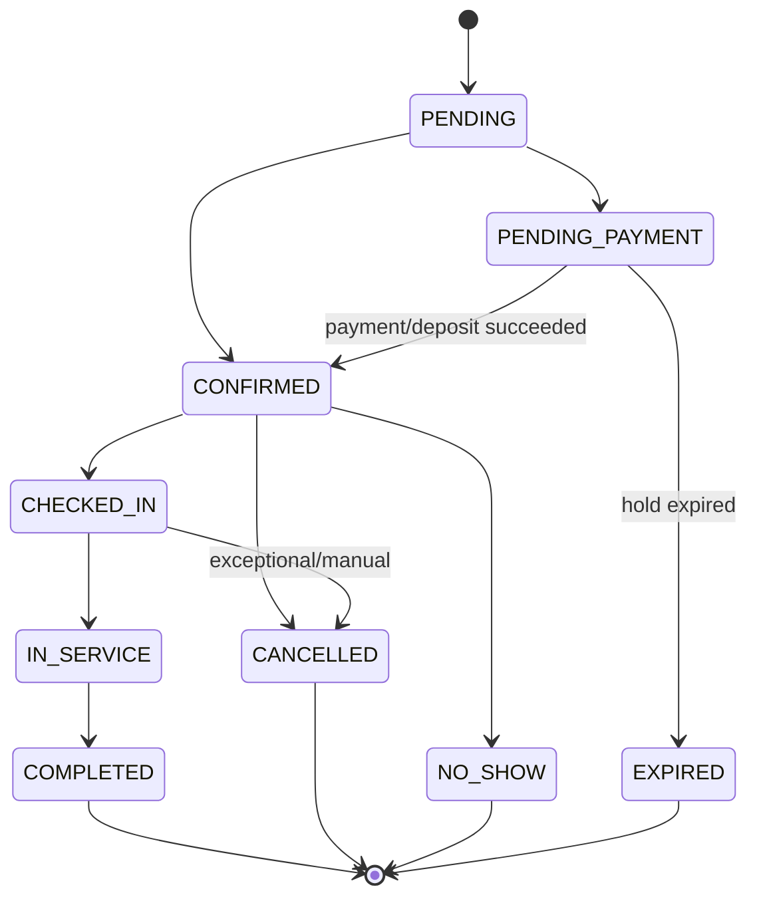

# BookFlow — State Machines & Business Rules

**Status:** Canonical Rules/Context Document  
**Source:** `BookFlow_Project_Overview.md` v1.0 — 17/09/2026  
**Scope:** Booking, availability, concurrency, queue, QR, voucher/payment consistency, realtime reconciliation and core domain invariants.

## 1. General domain invariants

1. PostgreSQL is the source of truth for transactional state.
2. Redis/WebSocket/cache never replace a DB validation on a critical mutation.
3. Every tenant mutation validates tenant scope and permission before changing state.
4. Every booking create/reschedule is concurrency-safe at the database layer.
5. State transitions are explicit. Do not update `status` arbitrarily.
6. Side effects such as notification/email/push occur after the critical state is committed.
7. Money is calculated server-side in minor units.
8. Time instants are persisted in UTC; schedule rules use branch/business IANA timezone.

## 2. Booking state machine

Canonical states:

```text
PENDING
PENDING_PAYMENT
CONFIRMED
CHECKED_IN
IN_SERVICE
COMPLETED
CANCELLED
NO_SHOW
EXPIRED
```

Canonical graph:



## 3. Booking transition table

| From | To | Trigger | Required checks |
|---|---|---|---|
| none | `PENDING` | booking creation begins | request/resources/policy/price validated |
| `PENDING` | `PENDING_PAYMENT` | deposit/payment required | protected slot hold created; `holdExpiresAt` set |
| `PENDING` | `CONFIRMED` | no payment required | slot protected and booking committed |
| `PENDING_PAYMENT` | `CONFIRMED` | verified provider payment success | webhook/event idempotency; hold not invalidated |
| `PENDING_PAYMENT` | `EXPIRED` | hold TTL elapsed | payment not successfully completed; expiry idempotent |
| `CONFIRMED` | `CHECKED_IN` | valid check-in | QR/auth/window/state; no duplicate active queue ticket |
| `CHECKED_IN` | `IN_SERVICE` | staff starts service | permission; assigned resource/state valid |
| `IN_SERVICE` | `COMPLETED` | staff completes service | permission; state valid; completion timestamp |
| `CONFIRMED` | `CANCELLED` | customer/business cancel | cancellation policy; refund policy if applicable |
| `CHECKED_IN` | `CANCELLED` | exceptional business operation | elevated permission/policy; audit required |
| `CONFIRMED` | `NO_SHOW` | business marks no-show | appointment window/policy; permission |

Terminal states:

```text
COMPLETED
CANCELLED
NO_SHOW
EXPIRED
```

A cancelled booking is not “reactivated”. Create a new booking if service must be booked again.

## 4. Booking occupancy rules

States that occupy staff/resource time:

```text
PENDING_PAYMENT  (only while holdExpiresAt > now)
CONFIRMED
CHECKED_IN
IN_SERVICE
```

States that do not occupy time:

```text
CANCELLED
COMPLETED
NO_SHOW
EXPIRED
```

`PENDING` is a transient application state; do not leave long-lived persisted bookings in `PENDING` without a defined lifecycle.

## 5. Booking interval semantics

For requested service execution:

```text
resourceStart = serviceStart - bufferBefore
resourceEnd   = serviceEnd + bufferAfter
```

Example:

```text
09:00-09:30 service
09:30-09:40 buffer after
next possible start = 09:40
```

Conflict checks compare the entire occupied resource interval, not only the visible service duration.

Overlap predicate:

```text
existing.start < requested.end
AND existing.end > requested.start
```

Apply buffer expansion consistently according to the effective staff/service configuration.

## 6. Availability inputs

Required logical inputs:

```text
branchId
serviceId
staffId?       # optional for Any Staff
date           # local YYYY-MM-DD
timezone       # resolved from branch override or business timezone
```

Data that affects availability:

- branch opening hours
- staff recurring working hours
- staff breaks
- staff leave
- special date overrides / blocked time
- existing occupied bookings
- booking buffers
- service duration
- staff-specific duration override if configured
- service/staff compatibility
- service/branch compatibility
- booking minimum lead time
- booking maximum advance window
- configured slot interval

## 7. Availability algorithm — exact sequence

### Step 1 — Resolve trusted resources

Resolve branch, service and optional staff within one business. Reject cross-tenant or incompatible resources.

### Step 2 — Resolve effective timezone

```text
branch.timezone ?? business.timezone
```

The request `date` is a local calendar date in that timezone.

### Step 3 — Validate booking window policy

Reject dates/times outside:

- minimum lead time
- maximum advance window
- branch/service online booking policy

### Step 4 — Build branch open intervals

For the local target date, create one or more intervals from `branch_opening_hours`.

If branch is closed, return no slots.

### Step 5 — Build staff working intervals

For each eligible staff member:

- resolve recurring working hours for weekday
- apply branch-specific schedule where configured
- apply special date overrides if implemented
- intersect with branch open intervals

### Step 6 — Subtract unavailable intervals

Subtract:

- recurring breaks
- date-specific breaks
- approved leave
- one-off schedule blocks

Result: raw staff free-working intervals before bookings.

### Step 7 — Fetch occupied bookings

Fetch only occupancy states relevant to the target staff/date range.

Expired holds are ignored when `holdExpiresAt <= now`; cleanup may be eager/lazy/worker-driven, but availability must not treat an already-expired hold as occupied.

### Step 8 — Expand occupied intervals for buffers

Apply the relevant resource occupation/buffer rules.

### Step 9 — Subtract occupied intervals

Subtract active booking/hold resource intervals from free-working intervals.

### Step 10 — Resolve effective service duration

```text
staff_services.custom_duration_minutes ?? services.duration_minutes
```

Pricing override is independent from duration override.

### Step 11 — Generate candidate starts

Generate starts aligned to the configured slot interval, for example 15 minutes.

Do not assume service duration is divisible by slot interval.

### Step 12 — Fit the whole resource interval

Keep a candidate only when its full requested occupied interval fits inside one free interval.

### Step 13 — Any Staff aggregation

When `staffId` is absent:

1. evaluate only active staff mapped to the branch and service,
2. calculate staff-specific availability independently,
3. merge identical start times,
4. retain the eligible staff IDs per slot internally/contractually,
5. return deterministic ordering by start time.

### Step 14 — Return sorted slots

Return ascending start times with explicit timezone/UTC timestamps.

## 8. Any Staff assignment strategy

Canonical strategy for booking creation when customer selected “Any Staff”:

1. Re-resolve eligible staff for the selected slot inside the create-booking transaction.
2. Order candidates deterministically by stable key (for example staff ID) unless a later explicit load-balancing policy is approved.
3. Attempt locking/conflict validation per candidate.
4. Assign the first candidate that remains available inside the transaction.
5. If no candidate remains available, return `BOOKING_SLOT_UNAVAILABLE`.

Do not assign a random staff member before protected availability recheck.

## 9. Availability caching

Allowed short-TTL cache key shape:

```text
bookflow:availability:{businessId}:{branchId}:{staffId|any}:{serviceId}:{date}
```

Rules:

- cache is read optimization only
- booking creation never trusts cached availability as final truth
- mutations affecting schedule/booking invalidate relevant keys
- cache key always includes tenant/resource identity

## 10. Double-booking race condition

Unsafe flow:

```text
A reads slot available
B reads slot available
A inserts booking
B inserts booking
```

A normal “find then create” sequence outside a protected transaction is forbidden.

## 11. Canonical booking write transaction

Create/reschedule must follow this logical order:

```text
1. Begin PostgreSQL transaction
2. Acquire deterministic DB concurrency lock
3. Resolve/re-resolve tenant-scoped resources
4. Recalculate conflict/availability inside transaction
5. Revalidate voucher usage if present
6. Create/update booking or hold
7. Create transactional dependent records/snapshots
8. Commit
9. Publish domain event after commit
10. Enqueue side effects/reminders
11. Invalidate availability cache
```

## 12. Locking strategy

Canonical default for BookFlow: PostgreSQL transaction + transaction-scoped advisory lock for the staff/resource/local-date partition.

Logical lock identity:

```text
businessId + branchId + staffId + localBusinessDate
```

Implementation requirements:

- generate a stable 64-bit advisory-lock key from the logical identity
- use `pg_advisory_xact_lock` so lock releases automatically at transaction end
- acquire locks in deterministic order when more than one resource is involved
- after the lock is acquired, query conflicts again inside the same transaction
- Redis lock may be added for coordination but is never the final correctness layer

Alternative: `SERIALIZABLE` transaction is allowed only when implemented/tested intentionally. Do not mix strategies casually.

## 13. Reschedule rules

Reschedule is not a direct `startAt` update.

Required sequence:

```text
validate booking state/policy
-> lock booking/current resource as needed
-> lock target resource/date
-> recheck target availability
-> update time/staff/snapshots as applicable
-> commit
-> publish booking.rescheduled
-> invalidate old and new availability caches
```

If conflict occurs, rollback and return `BOOKING_SLOT_UNAVAILABLE`.

## 14. Cancellation rules

Business-configurable policy inputs:

- `cancelBeforeMinutes`
- deposit refund yes/no/percentage
- optional cancellation fee

Cancellation must:

- validate current state
- validate actor permission/ownership
- apply policy according to booking time/business timezone
- create refund workflow if applicable
- transition booking to `CANCELLED`
- free availability after commit
- emit notification/event after commit

## 15. Slot hold rules

Payment/deposit flow may hold a slot:

```text
AVAILABLE -> HELD / PENDING_PAYMENT -> CONFIRMED
                                  \-> EXPIRED
```

Rules:

- `holdExpiresAt` is mandatory for `PENDING_PAYMENT` slot holds.
- hold TTL is configured; project target is 5–10 minutes.
- expiry is idempotent.
- worker or lazy cleanup may transition stale holds to `EXPIRED`.
- availability logic must treat elapsed holds as non-occupied even if cleanup has not yet persisted the state transition.

## 16. Payment state machine

Canonical provider/payment states from the overview:

```text
PENDING
PROCESSING
PAID
FAILED
CANCELLED
PARTIALLY_REFUNDED
REFUNDED
```

Rules:

- provider webhook is authoritative for provider result
- frontend success redirect is not authoritative
- provider webhook signature must be verified
- provider event ID must be stored uniquely
- duplicate webhook processing must not duplicate booking/payment transitions
- server computes expected amount/currency; do not trust client-provided totals

## 17. Payment/booking consistency

Typical deposit flow:

```text
booking hold created
-> payment intent/reference created
-> customer pays
-> verified webhook
-> idempotently mark payment PAID
-> booking PENDING_PAYMENT -> CONFIRMED
-> enqueue confirmation/reminders
```

If payment arrives after a hold was already expired, do not silently confirm a conflicting booking. Handle via reconciliation/refund/manual policy with explicit auditability.

## 18. Voucher rules

Validation order is fixed:

```text
1. voucher exists and active
2. current time inside validity window
3. business/branch/service applicability
4. minimum order
5. global usage limit
6. per-customer usage limit
7. calculate capped discount
```

Voucher usage creation must be transactionally consistent with booking/payment lifecycle so concurrent requests cannot exceed limits.

Percent values use integer basis points in the canonical schema.

## 19. Queue domain separation

Booking and queue are related but distinct domains.

Queue entry sources:

```text
appointment check-in
walk-in
manual business entry
```

A booking does not automatically equal a queue ticket until check-in/queue-join policy creates one.

## 20. Queue state machine

Canonical states:

```text
WAITING
CALLED
SERVING
COMPLETED
SKIPPED
CANCELLED
```

Canonical flow:

```text
WAITING -> CALLED -> SERVING -> COMPLETED
             |          |
             -> SKIPPED -> optional requeue policy
```

Allowed terminal states:

```text
COMPLETED
CANCELLED
```

`SKIPPED` may re-enter according to an explicit branch policy; do not assume automatic requeue.

## 21. Queue ordering

The system must support mixed appointment + walk-in queues. Do not hard-code plain FIFO as the only rule.

Canonical ordering inputs, in precedence order:

1. explicit `priority` (higher priority first when feature/policy permits)
2. scheduled appointment grace/eligibility rule
3. `joinedAt`
4. deterministic tie-breaker (`id`)

The exact appointment grace window is business/branch configurable and must not be silently hard-coded into UI code.

## 22. Queue ticket numbering

Numbers may reset per branch/business date:

```text
A001
A002
A003
```

Rules:

- public ticket number is not a primary key
- allocate via `queue_sequences` within a DB transaction
- uniqueness: `(branchId, businessDate, ticketNumber)`
- `businessDate` is calculated in branch timezone

## 23. Duplicate queue ticket prevention

Check-in must prevent multiple active queue tickets for the same booking.

Use both:

- transactional lookup/state validation
- a DB partial unique constraint when feasible for active queue states

Return `QUEUE_TICKET_ALREADY_EXISTS` for an idempotent duplicate check-in attempt according to API behavior.

## 24. Estimated waiting time

MVP deterministic estimate:

```text
sum(estimated duration of tickets ahead)
/ number of eligible serving staff
```

Future improvements may use historical duration/throughput/current elapsed time/no-show rate.

UI must communicate approximation, e.g. `~ 15 min`, never a guaranteed time.

## 25. QR check-in rules

Never encode only plain `bookingId` as the QR credential.

Payload/token includes or represents:

```text
type = booking_checkin
bookingId
customerId
expiry
nonce
```

Signed with a dedicated check-in secret/key.

Backend validation order:

```text
verify signature
-> verify expiry
-> load booking
-> verify authenticated customer or authorized scanner policy
-> verify booking state
-> verify early/late check-in window
-> prevent duplicate active queue ticket
-> transition/check-in transaction
```

Forgery/expired tokens return `QR_INVALID` / `QR_EXPIRED`.

## 26. Realtime rules

WebSocket is a delivery channel, not authoritative state.

Server room authorization is mandatory:

```text
business:{businessId}
branch:{branchId}
customer:{customerId}
staff:{staffId}
```

After reconnect:

```text
connect
-> reauthorize
-> fetch REST snapshot
-> reconcile TanStack Query cache
-> resume events
```

Do not attempt to reconstruct guaranteed state solely from missed events.

## 27. Background side effects

Critical DB state first, side effects second:

```text
API mutation
-> DB commit
-> domain event
-> BullMQ job
-> provider
-> delivery record
```

Jobs requiring retry must have an idempotency strategy (`jobId`/operation key).

## 28. Review rules

- booking must be `COMPLETED`
- one review per booking
- customer owns review content
- business may reply but cannot edit customer review text
- rating fields are `1..5`

## 29. Publish business rules

A business may be published only when it has at minimum:

- one active branch
- one active service
- one eligible staff member for the service or supported “any staff” configuration
- valid working hours

## 30. Test invariants

Mandatory integration/E2E assertions:

### Concurrency

Send multiple create-booking requests for the same staff/slot; exactly one conflicting booking/hold may commit.

### Tenant isolation

A member of Business A cannot read/update Business B resources by tampering with IDs.

### Payment webhook idempotency

Deliver the same provider event multiple times; state transition/side effects occur once.

### QR

Forged/expired tokens fail; duplicate check-in does not create duplicate active queue ticket.

### Timezone

Availability respects branch timezone and DST-aware library behavior where relevant.
